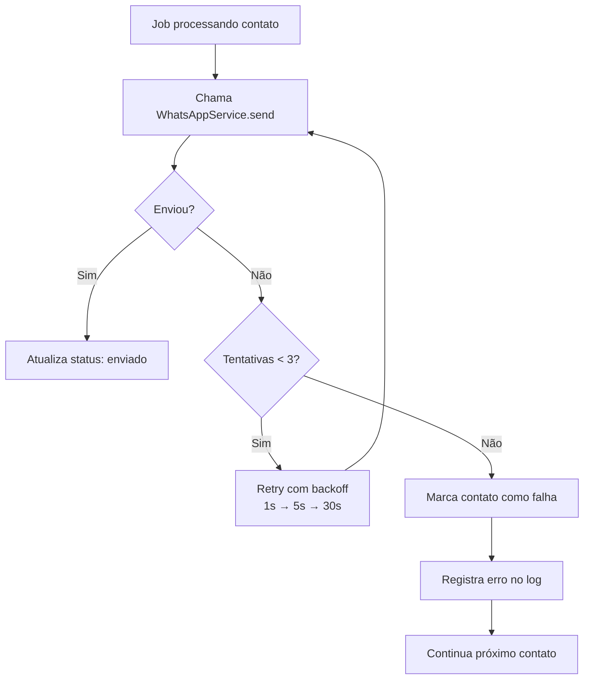
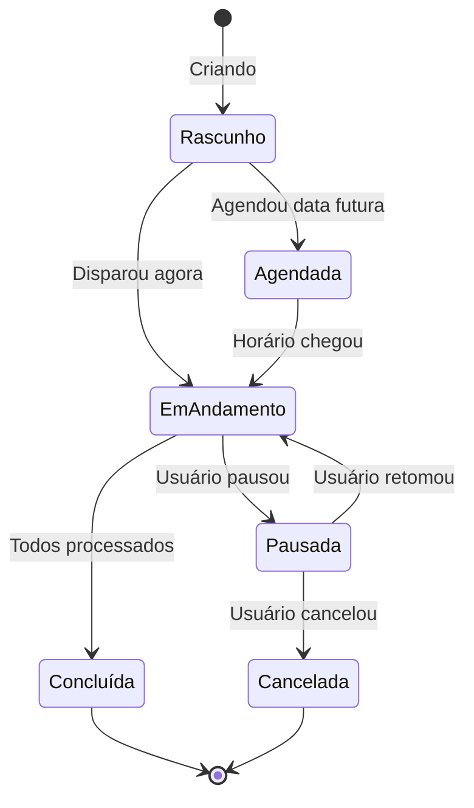

# Fluxo — Disparo em Massa

## Visão Geral

Usuário cria uma campanha de mensagens para uma lista de contatos,
configura o disparo e acompanha o progresso em tempo real.

---

## Fluxo Principal

```mermaid
flowchart TD
    A([Usuário acessa Disparos]) --> B{Tem instância\nconectada?}
    B -- Não --> C[Redireciona para\nConectar Instância]
    B -- Sim --> D[Lista campanhas anteriores]

    D --> E[Clica em Nova Campanha]

    E --> F[Passo 1: Seleciona instância WhatsApp]
    F --> G[Passo 2: Escolhe ou cria Template]

    G --> G1{Template existe?}
    G1 -- Sim --> G2[Seleciona template salvo]
    G1 -- Não --> G3[Cria novo template]
    G3 --> G4[Define tipo: texto / imagem / vídeo /\ndocumento / áudio]
    G4 --> G5[Adiciona variáveis: nome, empresa, etc.]
    G5 --> G6[Salva template]
    G2 --> H
    G6 --> H

    H[Passo 3: Seleciona lista de contatos]
    H --> H1{Lista existe?}
    H1 -- Sim --> H2[Seleciona lista salva]
    H1 -- Não --> H3[Adiciona contatos manualmente\nou importa CSV]
    H2 --> I
    H3 --> I

    I[Passo 4: Configura disparo]
    I --> I1[Define intervalo entre mensagens\nes: 5-15 segundos]
    I1 --> I2[Define horário: agora ou agendar]

    I2 --> J[Passo 5: Preview]
    J --> J1[Visualiza mensagem com variáveis\npreenchidas para um contato de exemplo]
    J1 --> J2{Confirma?}
    J2 -- Não --> G

    J2 -- Sim --> K[Cria campanha]
    K --> L[Jobs enfileirados no BullMQ\num job por contato + delay]

    L --> M[Status: Em andamento]
    M --> N[WebSocket emite progresso\nem tempo real]
    N --> O[Tela mostra: X de Y enviados\nEntregues / Falhas]

    O --> P{Todos processados?}
    P -- Não --> N
    P -- Sim --> Q[Status: Concluída]
    Q --> R[Relatório final disponível\nEnviados / Entregues / Falhas]
```

---

## Fluxo de Erro por Mensagem

---

## Estados de uma Campanha

---

## Tabelas envolvidas

| Tabela | Descrição |
|---|---|
| `campaigns` | Campanha com status, instância, template, configurações |
| `campaign_contacts` | Contato + status individual (pendente, enviado, falha) |
| `message_templates` | Templates reutilizáveis com variáveis |
| `contacts` | Base de contatos do tenant |

---

## Eventos WebSocket emitidos

| Evento | Quando |
|---|---|
| `campaign:progress` | A cada mensagem processada |
| `campaign:completed` | Quando campanha finaliza |
| `campaign:failed` | Erro crítico na campanha |
