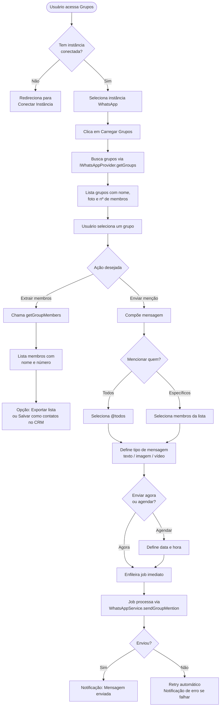
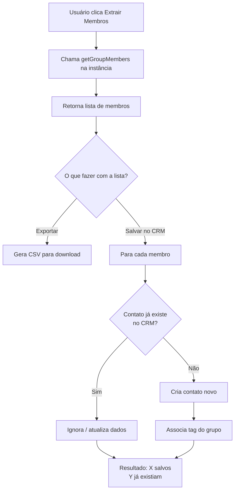
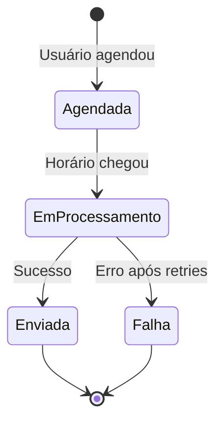

# Fluxo — Menções em Grupos

## Visão Geral

Usuário lista grupos do WhatsApp conectado, extrai membros
e envia mensagens mencionando todos ou membros específicos.

---

## Fluxo Principal

---

## Fluxo de Extração de Membros

---

## Estados de uma Menção Agendada

---

## Tabelas envolvidas

| Tabela | Descrição |
|---|---|
| `group_mentions` | Registro da menção: grupo, membros, mensagem, status |
| `group_mention_schedules` | Agendamentos pendentes |
| `contacts` | Membros salvos no CRM após extração |

---

## Eventos WebSocket emitidos

| Evento | Quando |
|---|---|
| `mention:sent` | Menção enviada com sucesso |
| `mention:failed` | Erro no envio |
