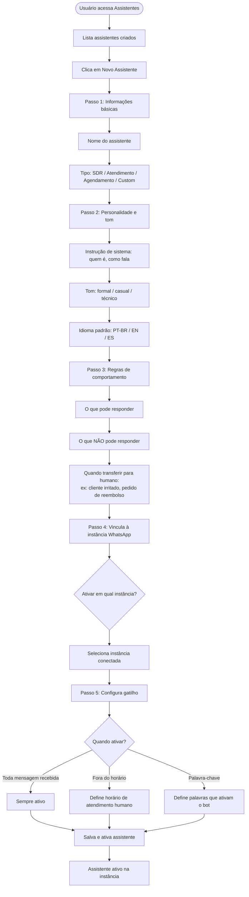
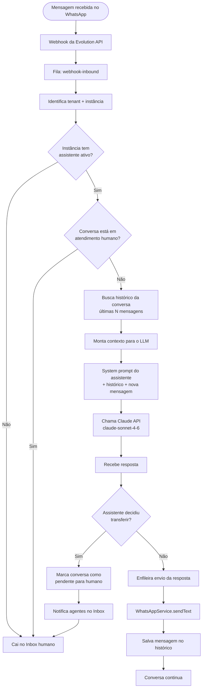
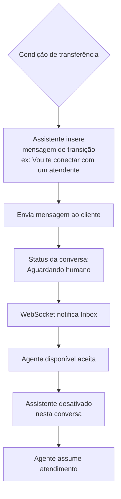
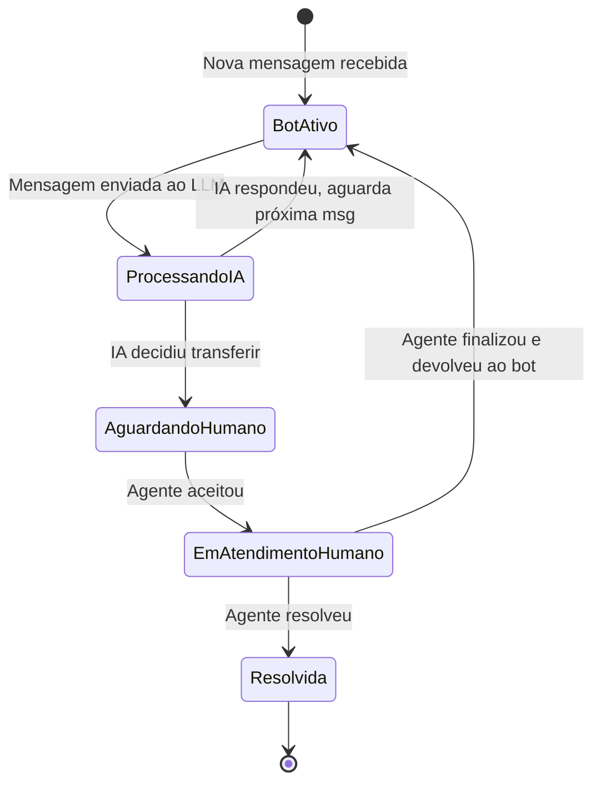

# Fluxo — Assistentes Virtuais (IA)

## Visão Geral

Usuário cria um assistente com personalidade, instruções e gatilhos.
O assistente responde mensagens automaticamente via LLM (Claude API).
Quando necessário, transfere para atendente humano.

---

## Fluxo de Criação do Assistente

---

## Fluxo de Atendimento pelo Assistente

---

## Fluxo de Transferência para Humano

---

## Estados de uma Conversa com Assistente

---

## Tabelas envolvidas

| Tabela | Descrição |
|---|---|
| `assistants` | Configuração do assistente: nome, prompt, tom, regras |
| `assistant_instances` | Vínculo assistente ↔ instância WhatsApp |
| `conversations` | Conversa com status atual |
| `messages` | Histórico completo de mensagens (contexto para IA) |

---

## Eventos WebSocket emitidos

| Evento | Quando |
|---|---|
| `assistant:responding` | IA processando resposta |
| `conversation:transferred` | Transferido para humano |
| `inbox:new_conversation` | Nova conversa aguardando agente |
