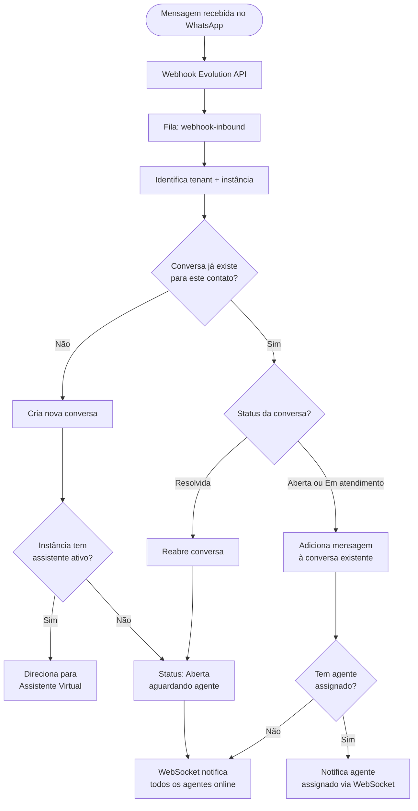
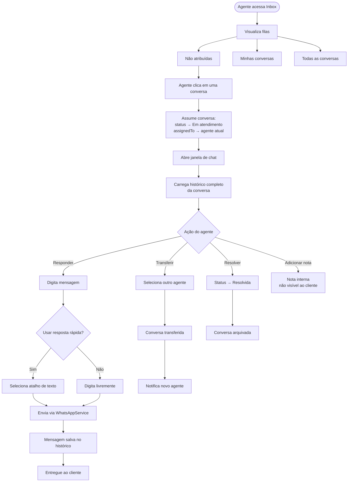
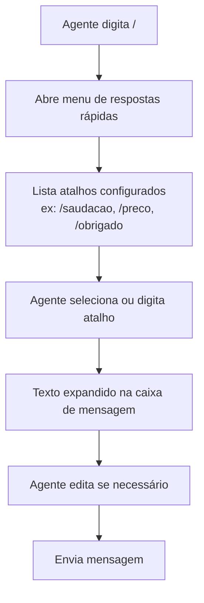
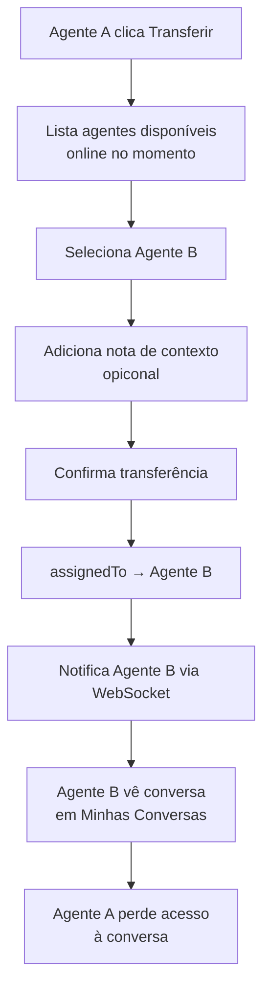
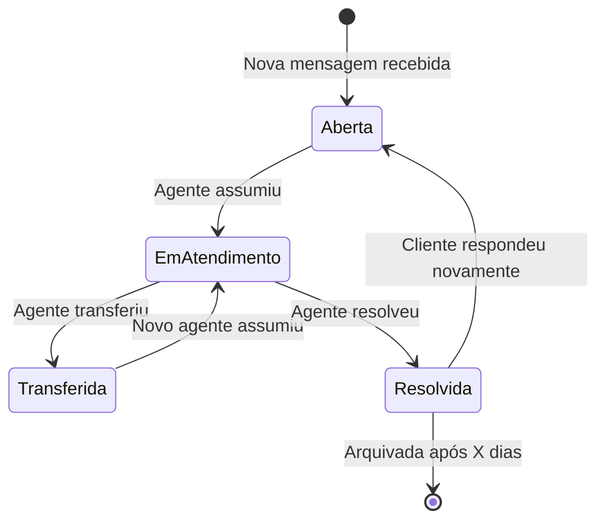

# Fluxo — Atendimento por Chat (Inbox)

## Visão Geral

Inbox centralizado multi-atendente. Mensagens chegam, são distribuídas
entre agentes, que atendem em tempo real com suporte a transferência e status.

---

## Fluxo de Entrada de Nova Conversa

---

## Fluxo do Agente no Inbox

---

## Fluxo de Resposta Rápida

---

## Fluxo de Transferência entre Agentes

---

## Estados de uma Conversa

---

## Tabelas envolvidas

| Tabela | Descrição |
|---|---|
| `conversations` | Conversa com status, agente assignado, instância |
| `messages` | Mensagens da conversa (entrada e saída) |
| `quick_replies` | Atalhos de texto por tenant |
| `conversation_notes` | Notas internas por conversa |
| `agents` | Referência aos users com role de agente |

---

## Eventos WebSocket emitidos

| Evento | Quando |
|---|---|
| `inbox:new_conversation` | Nova conversa sem agente |
| `inbox:new_message` | Mensagem recebida em conversa aberta |
| `inbox:conversation_assigned` | Conversa atribuída a agente |
| `inbox:conversation_transferred` | Conversa transferida |
| `inbox:conversation_resolved` | Conversa resolvida |
| `inbox:agent_typing` | Agente digitando (feedback visual) |
