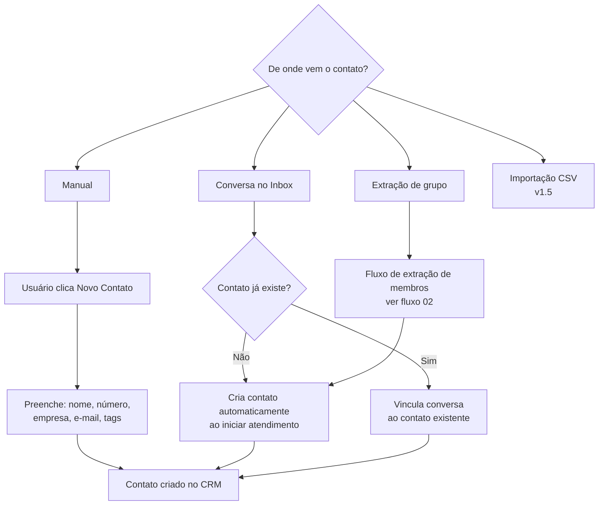
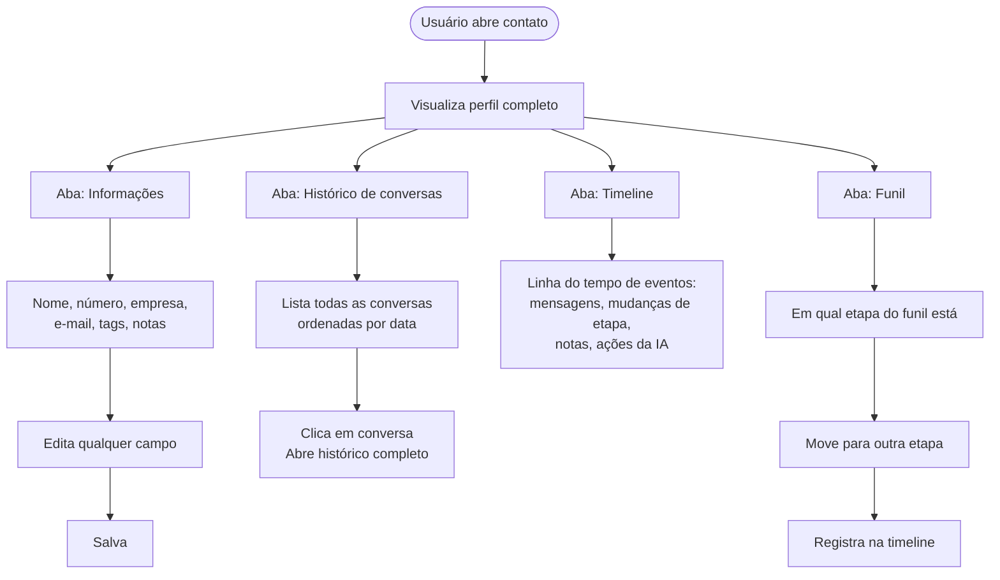
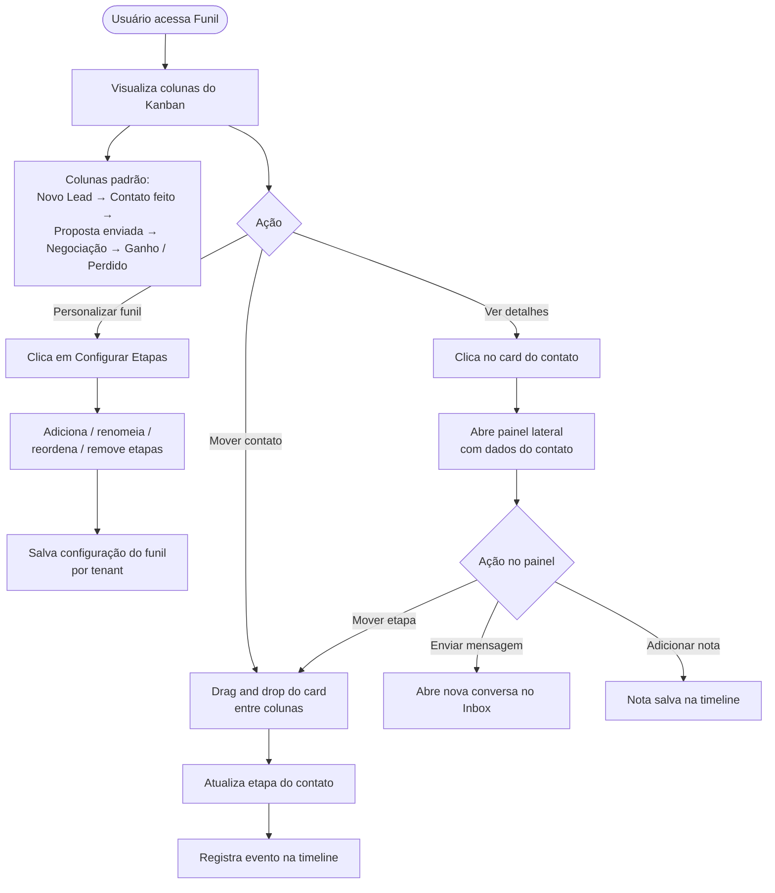
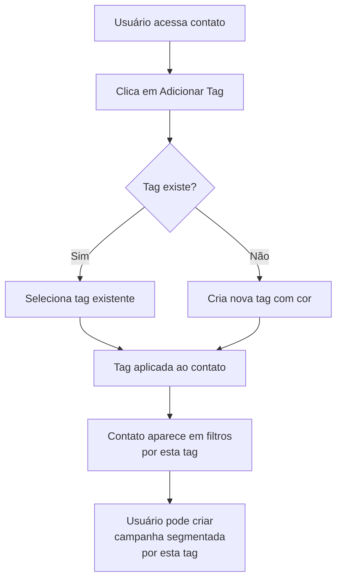
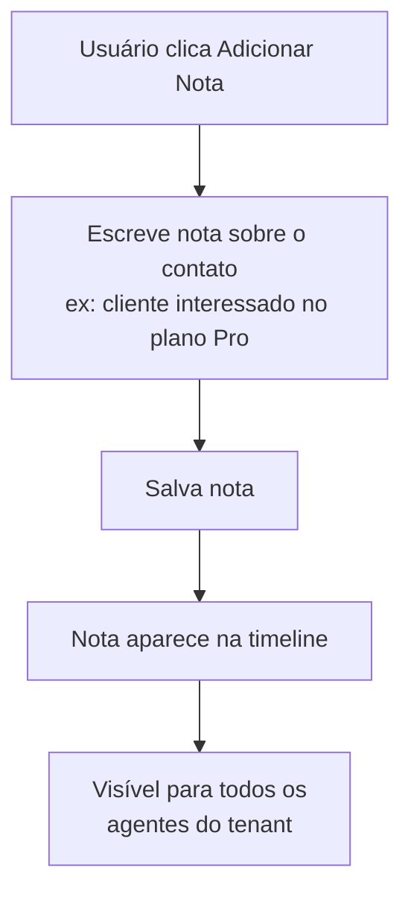
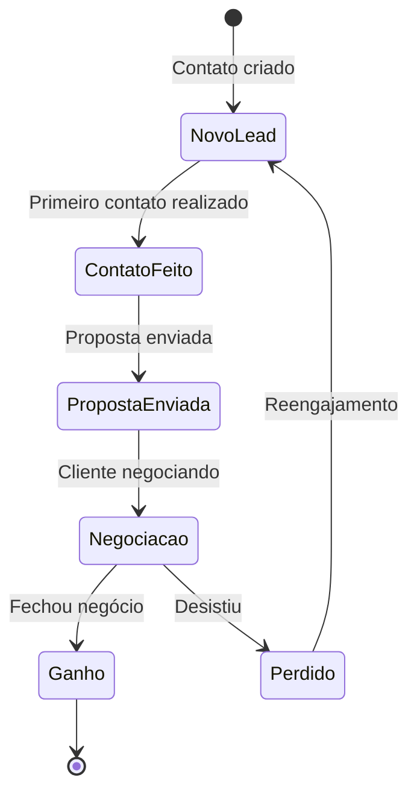

# Fluxo — CRM

## Visão Geral

Gestão completa de contatos com histórico de conversas, tags,
funil de vendas em Kanban e timeline de atividades.

---

## Fluxo de Entrada de Contato

---

## Fluxo de Gestão do Contato

---

## Fluxo do Funil Kanban

---

## Fluxo de Tags e Segmentação

---

## Fluxo de Notas Internas

---

## Estados de um Contato no Funil

---

## Tabelas envolvidas

| Tabela | Descrição |
|---|---|
| `contacts` | Dados do contato: nome, número, empresa, email |
| `contact_tags` | Tags aplicadas ao contato |
| `tags` | Tags disponíveis no tenant |
| `funnel_stages` | Etapas do funil customizadas por tenant |
| `contact_funnel` | Em qual etapa cada contato está |
| `contact_notes` | Notas internas por contato |
| `contact_timeline` | Eventos registrados na timeline |

---

## Eventos WebSocket emitidos

| Evento | Quando |
|---|---|
| `crm:contact_updated` | Dados do contato alterados |
| `crm:stage_changed` | Contato movido no funil |
| `crm:note_added` | Nova nota adicionada |
