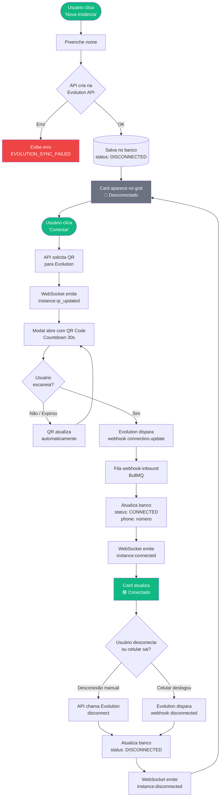
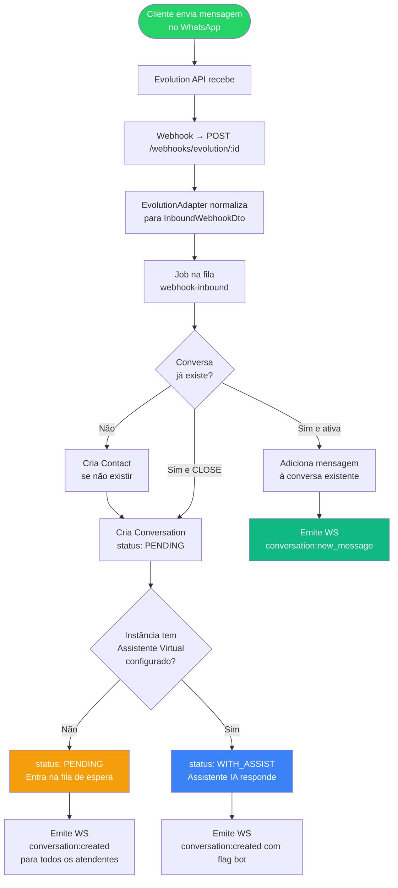
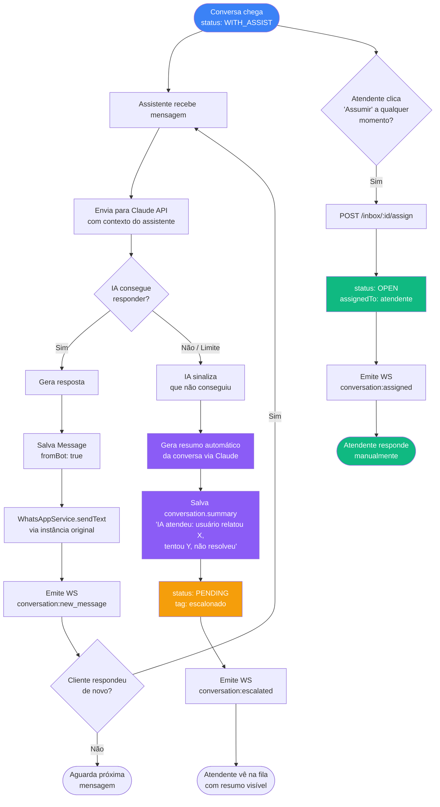
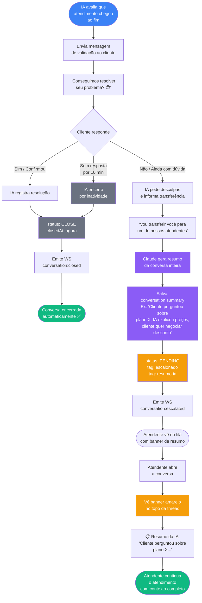
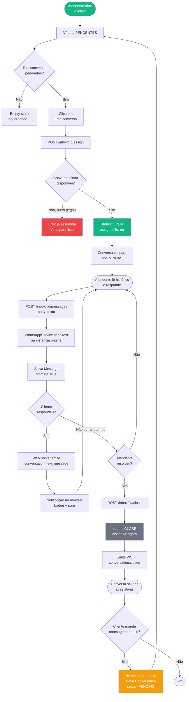
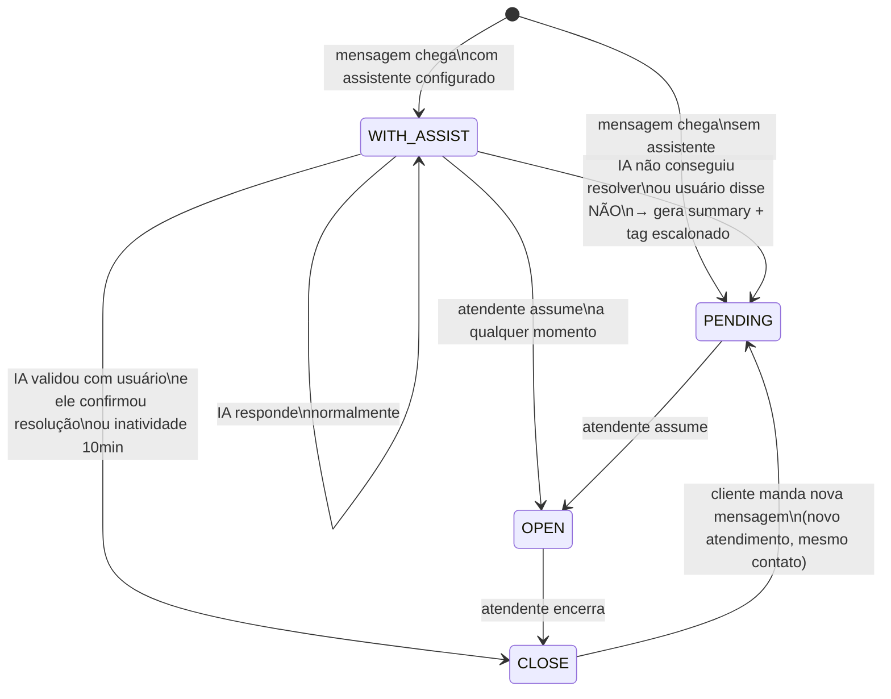
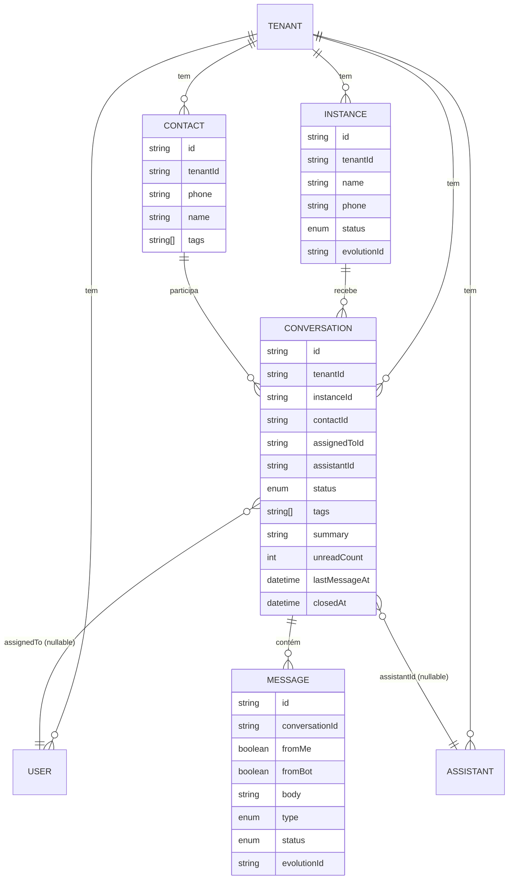
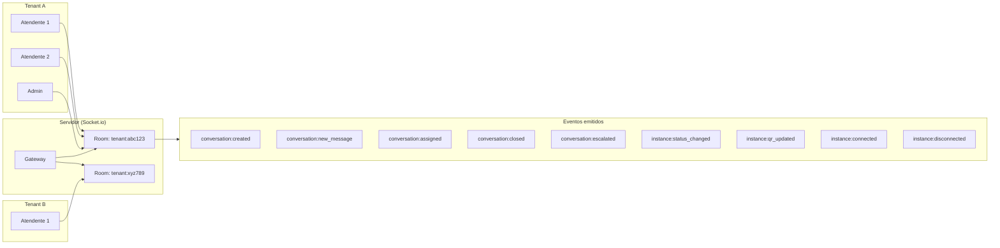

# Fluxogramas do Sistema

> Visualize no GitHub ou em qualquer editor com suporte a Mermaid (VSCode + extensão, Obsidian, etc.)

---

## 1. Módulo de Instâncias — Ciclo de vida

---

## 2. Inbox — Chegada de uma mensagem

---

## 3. Inbox — Fluxo do Assistente Virtual (IA)

---

## 3b. Inbox — Encerramento assistido pela IA

> A IA valida com o usuário se o problema foi resolvido antes de encerrar.
> Esse fluxo ocorre ao final de toda conversa tratada pelo Assistente Virtual.

---

## 4. Inbox — Atendente humano (fluxo completo)

---

## 5. Visão geral — Status e transições

---

## 6. Modelo de dados — Relacionamentos

---

## 7. Arquitetura de WebSocket — Rooms

